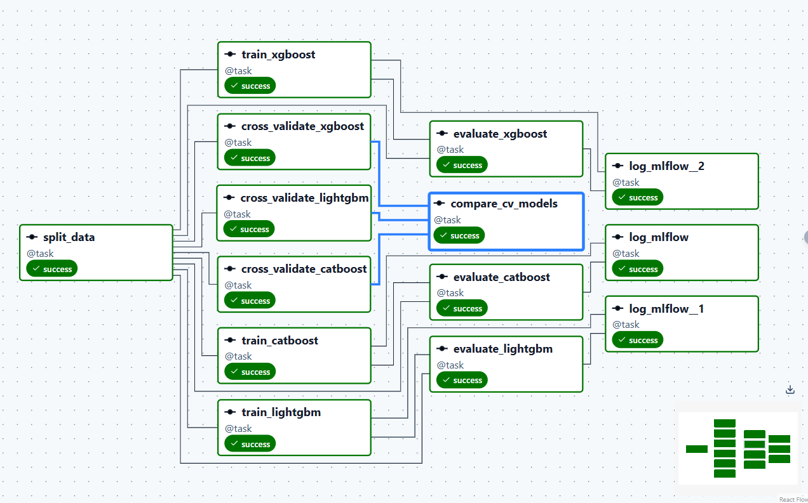
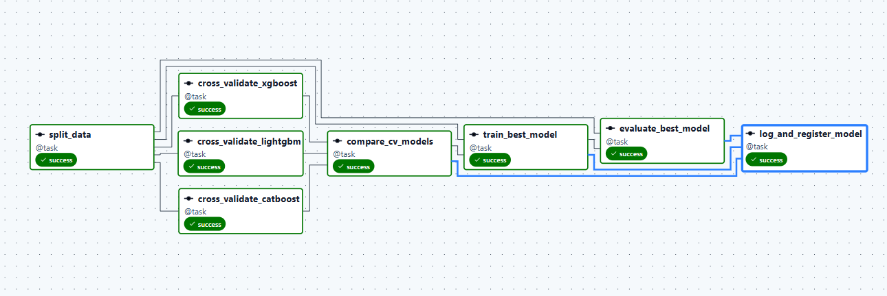

# Sprint 1 — Churn Prediction

Проект машинного обучения для прогнозирования оттока клиентов (`churn`).

В рамках проекта выполняется подготовка данных, обучение нескольких моделей классификации, их сравнение с помощью кросс-валидации, оценка на тестовой выборке и логирование результатов в MLflow.

## Цель проекта

Построить модель бинарной классификации, которая определяет вероятность ухода клиента.

Целевая переменная:

- `0` — клиент остаётся;
- `1` — клиент ушёл.

## Используемые технологии

- Python
- Pandas
- NumPy
- Scikit-learn
- CatBoost
- LightGBM
- XGBoost
- Apache Airflow
- MLflow
- PostgreSQL
- Parquet
- Docker / Docker Compose

## ML-пайплайн

Основной пайплайн реализован в Apache Airflow.

```text
Подготовка данных
        ↓
Разделение train / test
        ↓
Cross-validation
        ↓
CatBoost / LightGBM / XGBoost
        ↓
Сравнение CV-метрик
        ↓
Обучение моделей
        ↓
Оценка на test set
        ↓
Логирование в MLflow
        ↓
Выбор лучшей модели
```

## Кросс-валидация

Для сравнения моделей используются следующие метрики:

- `PR-AUC`
- `ROC-AUC`
- `F1-score`
- `Recall`
- `Precision`

Результаты кросс-валидации:

| Model | PR-AUC | ROC-AUC | F1 | Recall | Precision |
|---|---:|---:|---:|---:|---:|
| **CatBoost** | **0.6502** | **0.8386** | **0.6167** | **0.7394** | 0.5294 |
| LightGBM | 0.6134 | 0.8196 | 0.6027 | 0.6935 | 0.5333 |
| XGBoost | 0.6154 | 0.8187 | 0.5950 | 0.6669 | **0.5374** |

По результатам cross-validation лучшей моделью является **CatBoost**.

```text
Best CV model: catboost
PR-AUC:  0.650249
ROC-AUC: 0.838590
F1:      0.616695
```

CatBoost показывает лучшие значения по основным метрикам: PR-AUC, ROC-AUC, F1-score и Recall.

## Почему используется PR-AUC

Для задачи churn классы могут быть несбалансированы: клиентов, которые ушли, обычно меньше, чем клиентов, которые остались.

Поэтому `PR-AUC` используется как одна из основных метрик качества, поскольку она отражает баланс между:

- `Precision` — насколько точно модель определяет уходящих клиентов;
- `Recall` — какую долю реально уходящих клиентов модель смогла обнаружить.

Дополнительно используются ROC-AUC и F1-score.

## Обучаемые модели

### CatBoost

Градиентный бустинг на деревьях решений. Хорошо подходит для табличных данных и умеет эффективно работать с категориальными признаками.

### LightGBM

Быстрая реализация градиентного бустинга, ориентированная на высокую производительность и эффективную работу с большими датасетами.

### XGBoost

Популярная реализация градиентного бустинга с регуляризацией и широкими возможностями настройки.

## MLflow

MLflow используется для хранения информации об экспериментах и обученных моделях.

Для каждого запуска можно сохранять:

- параметры модели;
- метрики;
- артефакты;
- обученную модель;
- информацию о запуске.

Логическая структура эксперимента:

```text
MLflow Experiment
│
├── CatBoost run
│   ├── params
│   ├── metrics
│   └── model
│
├── LightGBM run
│   ├── params
│   ├── metrics
│   └── model
│
└── XGBoost run
    ├── params
    ├── metrics
    └── model
```

## MLflow Model Registry

После сравнения моделей лучшая версия может быть зарегистрирована в MLflow Model Registry.

Model Registry позволяет:

- хранить версии моделей;
- присваивать моделям единое имя;
- добавлять теги и описания;
- назначать aliases, например `champion` и `challenger`;
- управлять моделью, используемой в production;
- быстро переключаться между версиями.

Пример:

```text
churn_model

Version 1
Version 2 → challenger
Version 3 → champion
```

Модель можно загружать по alias:

```python
model = mlflow.pyfunc.load_model(
    "models:/churn_model@champion"
)
```

Это позволяет менять production-версию модели без изменения кода приложения.

## Apache Airflow

Airflow используется для оркестрации ML-пайплайна.

DAG:

```text
sprint1_r_train
```

Основные задачи пайплайна:

```text
split_data

cross_validate_catboost
cross_validate_lightgbm
cross_validate_xgboost

compare_cv_models

train_catboost
train_lightgbm
train_xgboost

evaluate_catboost
evaluate_lightgbm
evaluate_xgboost

log_mlflow
```

Задача `compare_cv_models` сравнивает результаты cross-validation и определяет лучшую модель.

Текущий результат:

```text
Best CV model: catboost
```

## Хранение данных

Для промежуточного хранения данных используется формат Parquet.

Преимущества Parquet:

- компактное хранение;
- высокая скорость чтения;
- сохранение типов данных;
- удобная работа с Pandas и аналитическими инструментами.

## Выбор итоговой модели

Cross-validation используется для предварительного выбора лучшего алгоритма.

После этого модели дополнительно оцениваются на отдельной тестовой выборке, которая не участвует в обучении и cross-validation.

Итоговую production-модель следует выбирать на основании test-метрик.

На текущем этапе лучший результат cross-validation показывает **CatBoost**.

## Возможное дальнейшее развитие

- подбор гиперпараметров;
- подбор оптимального classification threshold;
- анализ Feature Importance;
- SHAP-анализ;
- автоматическая регистрация лучшей модели в MLflow Model Registry;
- назначение aliases `champion` / `challenger`;
- автоматическое сравнение новой модели с текущей production-моделью;
- inference pipeline;
- мониторинг качества модели и data drift.

## Итог

В проекте построен воспроизводимый ML-пайплайн для сравнения нескольких алгоритмов классификации.

На этапе cross-validation лучший результат показывает **CatBoost**:

- PR-AUC — `0.6502`;
- ROC-AUC — `0.8386`;
- F1-score — `0.6167`;
- Recall — `0.7394`.

Следующий этап — сравнение моделей на test set и регистрация лучшей версии в MLflow Model Registry.

